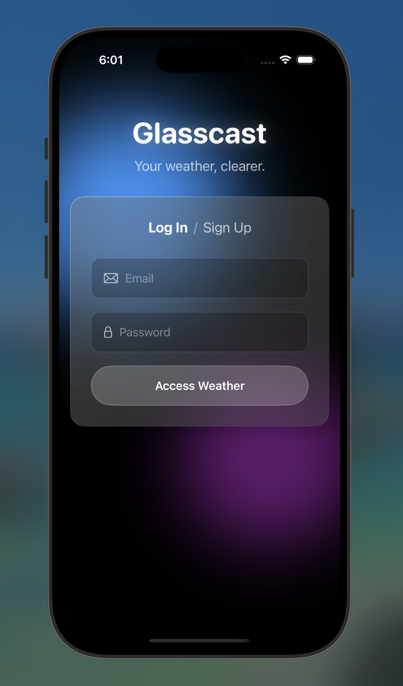
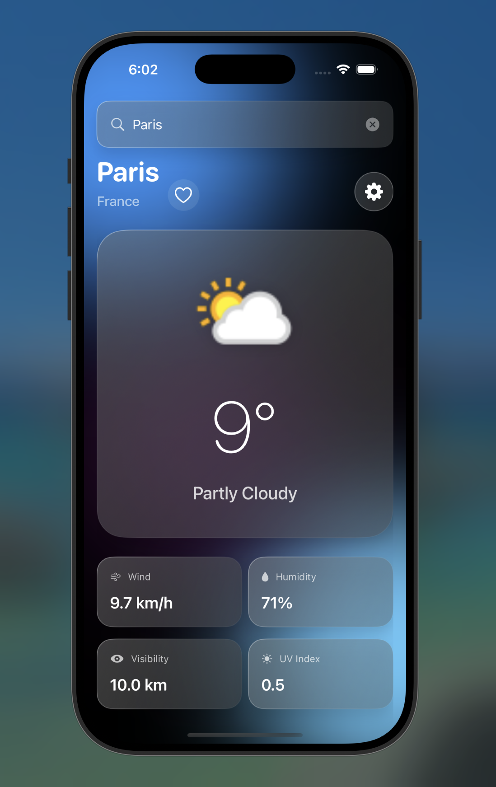

# Glasscast

Glasscast is a premium, AI-first weather application built with a focus on modern iOS design aesthetics—specifically the Liquid Glass system introduced in iOS 26. 

Built using SwiftUI, Supabase, and WeatherAPI, Glasscast offers a seamless experience for checking weather, managing favorite cities, and maintaining a secure personal account.

---

## Features

- **Liquid Glass Design**: Full implementation of glassmorphism with translucency, depth, and vibrant ambient light effects.
- **AI-First Development**: Developed entirely using agentic AI workflows (Claude Code/Cursor), demonstrating high-level iteration and prompt engineering.
- **Secure Authentication**: Powered by Supabase Auth with custom glassmorphic login/signup flows.
- **Real-time Weather**: Current weather data and details (Wind, Humidity, UV, Visibility) via WeatherAPI.
- **City Search**: Dynamic search capabilities to check weather anywhere in the world.
- **Cloud Favorites**: Save and sync your favorite cities to your Supabase account.
- **Unit Toggle**: Quickly switch between Celsius (°C) and Fahrenheit (°F).

---

## Setup Instructions

### Prerequisites
- Xcode 17.0+
- iOS 17.0+ (iOS 26 features utilized)
- Supabase Project
- WeatherAPI Key

### Installation

1. **Clone the repository**:
   ```bash
   git clone https://github.com/yourusername/GlasscastApp.git
   cd GlasscastApp
   ```

2. **Configuration**:
   The application comes pre-configured with the Supabase environment (URL and Anon key) so reviewers can immediately test authentication and favorites.

   For Weather Data, you must provide your own WeatherAPI key by creating a file at `GlasscastApp/Core/Secrets.swift`:
   ```swift
   import Foundation

   enum Secrets {
       static let weatherAPIKey = "YOUR_WEATHER_API_KEY"
   }
   ```
   *Note: This file is ignored by Git to keep the primary developer's key private.*

3. **Supabase Database Setup**:
   Ensure you have a table named `favourite_cities` (British spelling) with the following schema:
   - `id`: int8 (Primary Key)
   - `user_id`: uuid (References auth.users)
   - `city_name`: text
   - `latitude`: float8
   - `longitude`: float8
   - `created_at`: timestamptz

4. **Run the App**:
   Open `GlasscastApp.xcodeproj` in Xcode and run on a simulator or physical device.

---

## Architecture

The project follows the MVVM (Model-View-ViewModel) architectural pattern for clean separation of concerns:

- **Models**: Decodable API response structures.
- **Views**: SwiftUI-based modular UI components using the `GlassModifier`.
- **ViewModels**: Business logic and state management using `@Published` and `async/await`.
- **Services**: Networking layer using a custom `NetworkService` with REST implementation for Supabase and WeatherAPI.
- **Design System**: A centralized `Theme.swift` managing `AppColor` and `AppGradient` enums for consistent styling.

---

## AI Workflow

This project was developed using an AI-First methodology. 
- **Tooling**: Claude Code / Cursor.
- **Iteration**: Multi-agent task breakdown and iterative debugging (e.g., handling Supabase RLS and decoding mismatches).

---

## Screenshots

| Login Screen | Home (Weather) |
|---|---|
|  |  |

---

## Contributing

Contributions are welcome! If you have ideas for new glassmorphic components, better AI integrations, or bug fixes, please follow these guidelines:

### Reporting Bugs
- Use the GitHub Issue Tracker.
- Check if the bug has already been reported.
- Include steps to reproduce and screenshots if possible.

### Suggesting Enhancements
- Open an issue with the "enhancement" tag.
- Explain why this feature would be useful and how it fits the Liquid Glass aesthetic.

### Pull Requests
1. Fork the repo and create your branch from `main`.
2. Ensure your code follows the existing MVVM architecture.
3. If you've added a new feature, update the README.md if necessary.
4. Ensure the app builds and runs without errors.
5. Issue a PR with a clear description of your changes.

### Design Guidelines
Glasscast is strictly built on the Liquid Glass system. 
- Use `Theme.AppColor` and `Theme.AppGradient` for all styling.
- Prefer SF Symbols with `.multicolor` or `.hierarchical` rendering modes.
- Keep the blur and translucency consistent with existing `glassEffect` modifiers.

---

## License

This project is licensed under the [MIT License](./LICENSE). Feel free to use it as a reference for your own glassmorphic SwiftUI projects.
